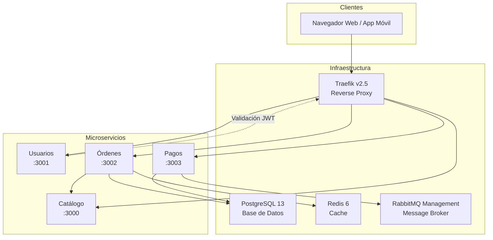
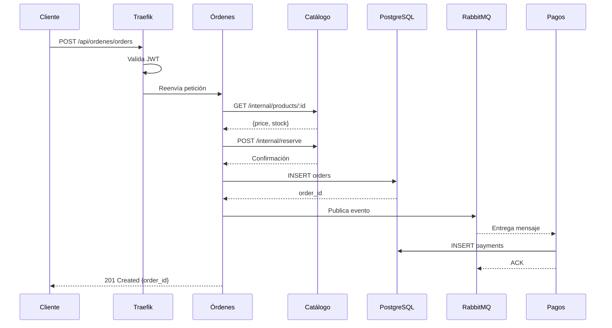

# Reporte de Estado del Proyecto Marketplace-Integral

## Resumen Ejecutivo

Este proyecto corresponde a una **arquitectura de microservicios** para un sistema de marketplace (comercio electrónico), implementado con tecnologías modernas de contenedores y servicios cloud-native.

## Estado del Proyecto: **En Desarrollo** 🚧

El proyecto se encuentra en una **etapa de desarrollo funcional** con los componentes base implementados y ejecutables. La arquitectura demuestra un diseño coherente de microservicios con comunicación síncrona y asíncrona.

---

## Arquitectura del Sistema



---

## Tecnologías Utilizadas

### runtime: Node.js
- **Versión:** Node 14 (especificada en Dockerfiles)
- **Framework Principal:** Express.js v4.17.1

### Contenedores y Orquestación

| Servicio | Tecnología | Versión |
|----------|------------|---------|
| Contenedores | Docker | - |
| Orquestación | Docker Compose | v3.8 |
| API Gateway | Traefik | v2.5 |
| Base de Datos | PostgreSQL | 13 |
| Cache | Redis | 6 |
| Message Broker | RabbitMQ | management |

### Librerías y Dependencias

| Microservicio | Dependencias |
|---------------|---------------|
| **Catálogo** | express |
| **Usuarios** | express, jsonwebtoken |
| **Órdenes** | express, axios, pg |
| **Pagos** | express, amqplib, pg |

### Autenticación
- **JWT (JSON Web Token)** para autenticación stateless
- **Traefik ForwardAuth** como middleware de validación

---

## Microservicios Implementados

### 1. Servicio de Catálogo (Puerto 3000)
- **Función:** Gestión de productos e inventario
- **Datos:** Almacenamiento en memoria (simulado)
- **Rutas internas:**
  - `GET /internal/products/:id` - Consulta precio y stock
  - `POST /internal/reserve` - Reserva de stock
- **Estado:** 🟡 Funcional básico (datos en memoria)

### 2. Servicio de Usuarios (Puerto 3001)
- **Función:** Autenticación y gestión de usuarios
- **Dependencias:** JWT_SECRET del archivo .env
- **Rutas:**
  - `GET /` - Health check
  - `POST /validate-token` - Validación de JWT para Traefik
- **Estado:** 🟢 Funcional

### 3. Servicio de Órdenes (Puerto 3002)
- **Función:** Creación y gestión de órdenes
- **Dependencias:** PostgreSQL, Redis, RabbitMQ, Catálogo
- **Funcionalidades:**
  - Consulta de precios con el servicio de catálogo
  - Reserva de stock
  - Persistencia en PostgreSQL
- **Estado:** 🟢 Funcional

### 4. Servicio de Pagos (Puerto 3003)
- **Función:** Procesamiento de pagos
- **Dependencias:** PostgreSQL, RabbitMQ
- **Arquitectura:** Consumidor de cola de mensajes
  - Cola: `order_events`
  - Procesa eventos de órdenes
- **Estado:** 🟡 Parcial (esperando mensajes)

---

## Configuración de Infraestructura

### Variables de Entorno (.env)
```
POSTGRES_USER=myuser
POSTGRES_PASSWORD=mypassword
POSTGRES_DB=mydatabase
JWT_SECRET=mi_clave_secreta_jwt
```

### Puertos Expuestos
| Servicio | Puerto Externo | Puerto Interno |
|----------|----------------|----------------|
| Traefik | 80 | - |
| PostgreSQL | 5432 | 5432 |
| Redis | 6379 | 6379 |
| RabbitMQ | 15672 (UI), 5672 (AMQP) | - |
| Catálogo | - | 3000 |
| Usuarios | - | 3001 |
| Órdenes | - | 3002 |
| Pagos | - | 3003 |

---

## Estado de Funcionalidades

### ✅ Completadas
- [x] Arquitectura de microservicios con Docker
- [x] Configuración de Traefik como API Gateway
- [x] Sistema de autenticación JWT
- [x] Servicio de catálogo con gestión de inventario
- [x] Servicio de órdenes con persistencia PostgreSQL
- [x] Servicio de pagos con RabbitMQ
- [x] Comunicación síncrona entre servicios (HTTP)
- [x] Comunicación asíncrona (Colas de mensajes)

### ⚠️ Pendientes / Mejoras
- [ ] Integración real del servicio de pagos con el de órdenes
- [ ] Tabla de payments en PostgreSQL (no está creada)
- [ ] Sistema de logging centralizado
- [ ] Health checks detallados
- [ ] Tests unitarios y de integración
- [ ] Documentación de APIs (Swagger/OpenAPI)
- [ ] CI/CD pipeline
- [ ] Métricas y monitoreo (Prometheus/Grafana)

---

## Diagrama de Flujo de una Orden



---

## Recomendaciones

1. **Seguridad:** Cambiar las credenciales por defecto en .env
2. **Persistencia:** Implementar base de datos real para el catálogo
3. **Integración:** Conectar el flujo de órdenes → pagos con RabbitMQ
4. **Escalabilidad:** Añadir balanceador de carga y auto-scaling
5. **Observabilidad:** Implementar sistema de logs, métricas y tracing
6. **Testing:** Crear suite de pruebas automatizadas

---

## Conclusión

El proyecto se encuentra en un **estado funcional de desarrollo** con una arquitectura de microservicios bien definida. La infraestructura base está completa y operativa, aunque faltan funcionalidades de integración entre algunos servicios (especialmente el flujo de órdenes a pagos). Es un buen punto de partida para un marketplace completo.

**Nivel de Madurez:** 6/10 (Prototipo funcional)
